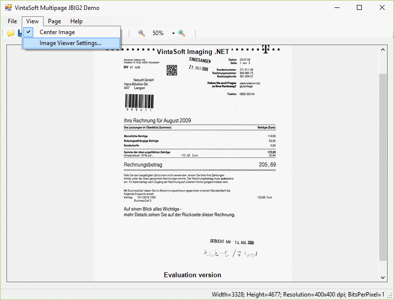

# VintaSoft WinForms JBIG2 Demo

This C# project uses <a href="https://www.vintasoft.com/vsimaging-dotnet-index.html">VintaSoft Imaging .NET SDK</a> and demonstrates how to work with multipage JBIG2 files:
* Create, display and save single/multi-page JBIG2 file.
* Navigate JBIG2 images: first, previous, next, last.
* Change JBIG2 image preview settings.
* Manipulate JBIG2 file pages: add, insert, remove.


## Screenshot



## Usage
1. Get the 30 day free evaluation license for <a href="https://www.vintasoft.com/vsimaging-dotnet-index.html" target="_blank">VintaSoft Imaging .NET SDK</a> as described here: <a href="https://www.vintasoft.com/docs/vsimaging-dotnet/Licensing-Evaluation.html" target="_blank">https://www.vintasoft.com/docs/vsimaging-dotnet/Licensing-Evaluation.html</a>

2. Update the evaluation license in "CSharp\MainForm.cs" file:
   ```
   Vintasoft.Imaging.ImagingGlobalSettings.Register("REG_USER", "REG_EMAIL", "EXPIRATION_DATE", "REG_CODE");
   ```

3. Build the project ("Jbig2Demo.Net8.csproj" file) in Visual Studio or using .NET CLI:
   ```
   dotnet build Jbig2Demo.Net8.csproj
   ```

4. Run compiled application and try to work with multipage JBIG2 files.


## Documentation
VintaSoft Imaging .NET SDK on-line User Guide and API Reference for .NET developer is available here: https://www.vintasoft.com/docs/vsimaging-dotnet/


## Support
Please visit our <a href="https://myaccount.vintasoft.com/">online support center</a> if you have any question or problem.
